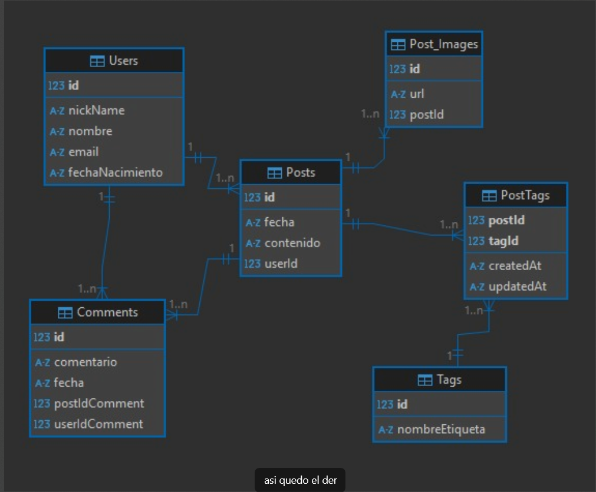

# 💥 Anti-Social Relational - Los Crudos

Proyecto desarrollado por el grupo **Los Crudos** para la materia *Construcción de Interfaces de Usuario*.  
Se trata de una aplicación web que explora interacciones sociales digitales de manera crítica y creativa.

---

## 🎯 Descripción

**Anti-Social Relational** es una interfaz experimental que simula una red social con un enfoque irónico sobre la conectividad digital y las relaciones interpersonales. Su diseño busca ser provocador, funcional y visualmente impactante.

—

#Esquema DER




## 🚀 Funcionalidades Principales

- 🧩 Interfaz interactiva con usuarios ficticios
- 🧵 Feed dinámico con publicaciones generadas
- 📄 Documentación con Swagger (`swagger.yaml`)
- 🎭 Enfoque anti-convencional en la experiencia de usuario
- 💅 Estética disruptiva con diseño propio

---


## 🛠️ Tecnologías Utilizadas

- **Node.js**
- **Express** `^5.1.0`
- **Joi** `^17.13.3`
- **Sequelize** `^6.37.7`
- **SQLite3** `^5.1.7`
- **Nodemon** (desarrollo) `^3.1.10`
- **Sequelize CLI** (desarrollo) `^6.6.3`

---
##ENDPOINTS

Los endpoints pueden ser visualizados Swagger incluido en el proyecto

##Colecciones POSTMAN

Estos se encuentran en la carpeta src/data del proyecto
## 📦 Instalación

1. Clonar el repositorio:

```bash
git clone https://github.com/tu_usuario/anti-social-relational-los-crudos.git
cd anti-social-relational-los-crudos

2.Instalar dependencias:


npm install

3.npx sequelize-cli db:migrate
npx sequelize-cli db:seed:all

4.Ejecutar el servidor de desarrollo: npm run dev

5.Abrir el navegador en:
"http://localhost:3000" o entorno de ejecución designado


Estructura del proyecto:

anti-social-relational-los-crudos/
├── assets/
├── src/
	└── controllers
	└── data
	└── db
	└── middlewares
	└── routes
	└── schemas
	└── main.js
├── package-lock.json
├── package.json
├── swagger.yaml
└── README.md
